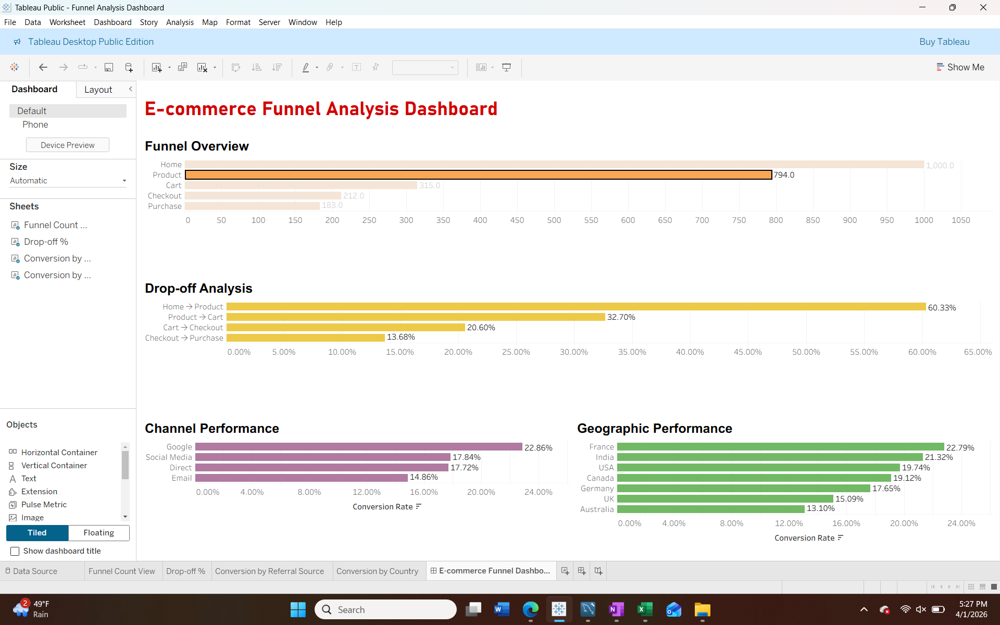

# E-commerce Funnel Analysis – User Journey Optimization

## Overview
This project analyzes user behavior across an e-commerce funnel to identify drop-off points and optimize conversion rates across different stages of the user journey.

---

## Key Insights
- Significant drop-off (~60%) observed at **Product → Cart** stage  
- **Google** drives the highest conversion (~23%) among all channels  
- Strong performance observed from **France and India**  
- Low drop-off at **Checkout → Purchase** indicates high purchase intent  

---

## Dashboard
Below is the Tableau dashboard showing funnel performance, drop-offs, and channel insights:

!

---

## Funnel Stages Analyzed
- Home → Product  
- Product → Cart  
- Cart → Checkout  
- Checkout → Purchase  

---

## Approach
- Transformed raw event-level data into **session-level funnel metrics using SQL**  
- Calculated **conversion rates and drop-off percentages** across funnel stages  
- Analyzed performance across **channels and geographies**  
- Built an interactive **Tableau dashboard** to visualize user journey  

---

## Business Recommendations
- Improve **product page experience** to reduce drop-off  
- Optimize **Add-to-Cart flow**  
- Invest more in **high-performing channels (Google)**  
- Focus on **high-converting regions** for targeted marketing  

---
board.png)
